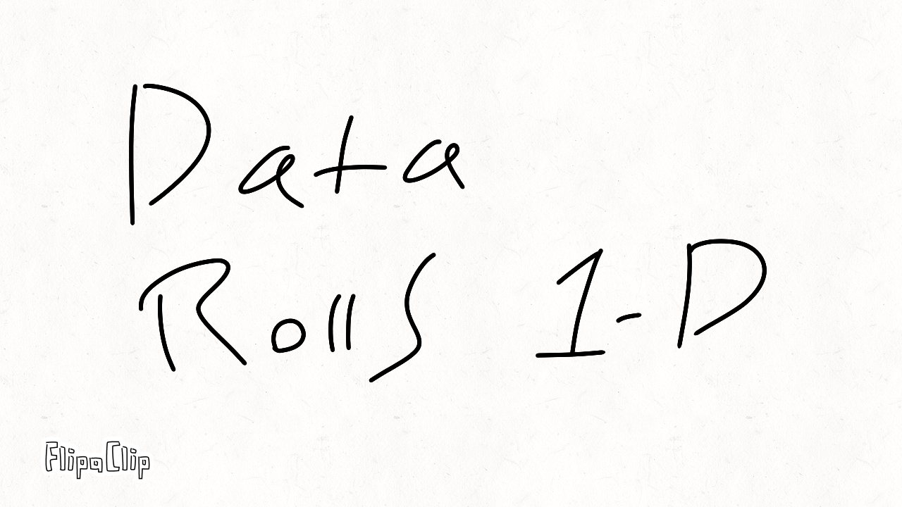

# DataChains todo add data roll
#### Python Lists for ANY! programming language
please see:  
[data chains script](datachain.py)

#### LinkedLists & DoublyLinkedLists

## For Solutions:  
([fundamental mechanism](explanations/fundamentalmechanism.ipynb))  

  
please see (labeled):  
[linkedlists](explanations/shortandsweet.ipynb)  
  
please see (un-labeled):  
*  [doubly_linkedlists](doubly_linkedlists.ipynb)

[linkedlists](linkedlists.ipynb)

## For Explanations: (w/ Tape)
please see:
[data chains using tape notebook](explanations/data_chains.ipynb)

downward boxes animation:

([MyNumber](explanations/fundamentalmechanism.ipynb))  

# Advancements of this approach  

we need to add the ability to copy python slicing

slicing not added but here is the current work in progress:  
[slicing (unfinished)](slicing_wip/slicing_todo.ipynb)  
[previous next](previous_next_n.ipynb)  
[previous-next](previousandnextnlinkedlist.ipynb)  
[que](que.ipynb)  
[stack](stack.ipynb)  
[target data structure TitanFall example](TitanFall/target-data-structure.ipynb)

  

# Access Mesh (in testing)  

# save the reactor mini game  

